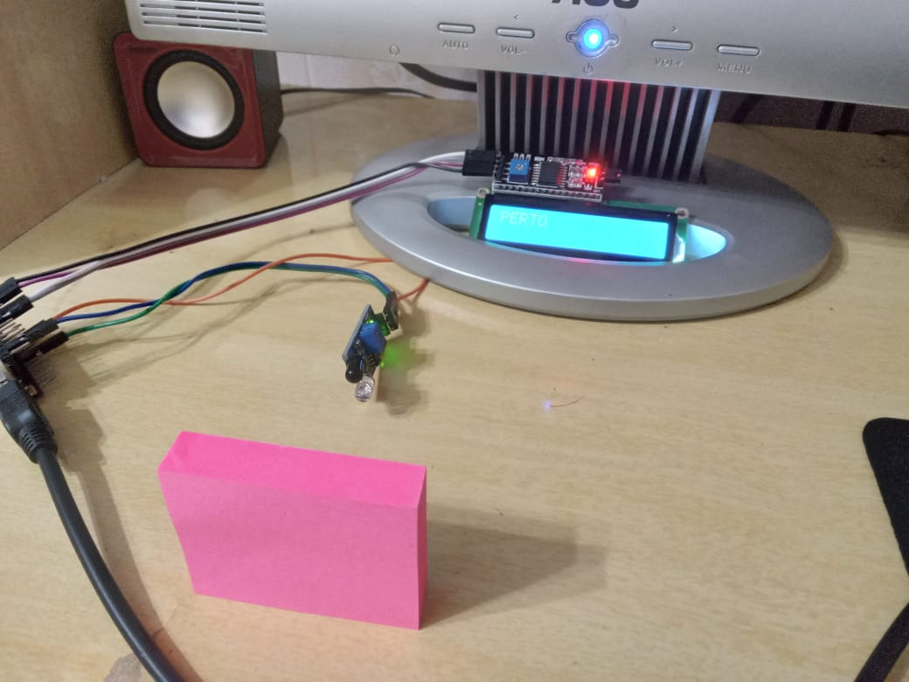
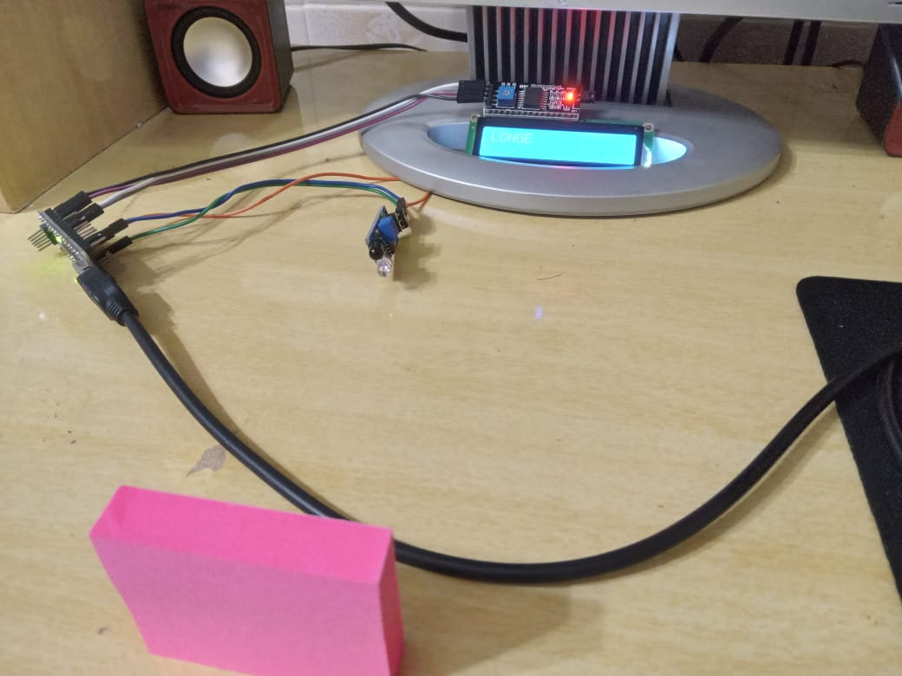
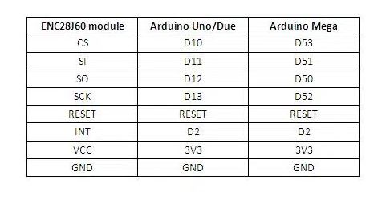

# Arduino COM SENSOR INFRA VERMELHO E DISPLAY LCD COM COMUNIÇÃO VIA I2C

## Referências extraidas das páginas brincando com idéias e blogmasterwalkershop

 Quando um objeto é inserido próximo ao sensor IR o mesmo envia um sinal digital ao pino 5 da placa arduino indicando que existe algo próximo e uma impressão com o dizer "PERTO" é executada no display 

 Quando um não há um objeto próximo ao sensor IR o mesmo envia um sinal digital ao pino 5 da placa arduino indicando que não existe algo próximo e uma impressão com o dizer "LONGE" é executada no display 

SEGUE ABAIXO ESQUEMA DE LIGAÇÃO (DIAGRAMA ELETRÔNICO)

